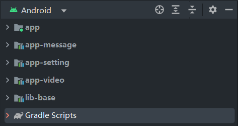

<p>
<center>
<font size = '6'>
模块化开发架构
</font>
</center>
</p>

### 为什么使用模块化架构开发方式

> &emsp;&emsp;在项目组开发过程中，一个项目业务有很多，每个成员都负责一部分业务开发，这个时候业务代码全部都糅杂在一起，不管是后面维护和代码阅读，都是很困难的，这个时候我们就想到使用模块化方式开发，也就是把每一块的业务独立出来开发，每个人负责自己的模块，分工明确、工程结构清晰、互不干扰...

### 思想：

>  &emsp;&emsp;我们使用生产环境来控制我们的模块之间的关系，测试环境每个模块独立运行，让开发团队中成员实现模块独立开发以及独立调试以达到模块间互不干扰。

1、创建工程和业务模块，这里举例使用`app-message`、`app-setting`、`app-video`三个业务模块来举例
2、在工程的根目录创建`env.gradle`文件，然后在`env.gradle`文件中定义一个变量`isRelease`来控制当前所属环境。

```kotlin
ext {
    isRelease = true
}
```

3、在工程根目录的`build.gradle`中引入`env.gradle`文件，这样以来我们就能在各个模块的gradle文件中使用`env.gradle`里面的信息了

```kotlin
plugins {
    id 'com.android.application' version '7.4.2' apply false
    id 'com.android.library' version '7.4.2' apply false
    id 'org.jetbrains.kotlin.android' version '1.8.0' apply false
}
apply from: 'env.gradle'
```

4、有了控制环境的`isRelease`之后我们来说如何使用，项目团队开发中，自己负责自己的业务模块，这个时候需要模块独立运行，所以这个时候`app-message``app-setting``app-video`是`application`;上线打包的时候业务模块就不需要独立运行，而是交给`app`模块调度，这个时候`app-message``app-setting``app-video`就是`library`了；由此我们只需要通过判断`isRelease`来修改模块的`build.gradle`就行了，代码如下：

```kotlin
plugins.apply('org.jetbrains.kotlin.android')

if (isRelease) {
    plugins.apply('com.android.library')
} else {
    plugins.apply('com.android.application')
}

android {...}

dependencies {...}
```

每个业务模块都配置好了上面的代码之后，我们去修改`env.gradle`文件中的`isRelease`属性后点击`sync`来看看工程结构的效果吧；

5、因为项目中有多个模块，每个模块的`build.gradle`文件中都有相同的`dependencies`包，便于管理，我们抽取相同的内容到`env.gradle`中

```kotlin
ext {
    isRelease = true

    androidx = [
            ktx             : 'androidx.core:core-ktx:1.7.0',
            appcompat       : 'androidx.appcompat:appcompat:1.4.1',
            constraintlayout: 'androidx.constraintlayout:constraintlayout:2.1.3'
    ]

    google = [
            material: 'com.google.android.material:material:1.5.0'
    ]

    test = [
            junit   : 'junit:junit:4.13.2',
            ext     : 'androidx.test.ext:junit:1.1.3',
            espresso: 'androidx.test.espresso:espresso-core:3.4.0'
    ]
}
```

然后我们在每个模块中的`build.gradle`中这样使用即可

```kotlin
dependencies {
    implementation androidx.ktx
    implementation androidx.appcompat
    implementation google.material
    implementation androidx.constraintlayout
    testImplementation test.junit
    androidTestImplementation test.ext
    androidTestImplementation test.espresso
}
```

这样做的优点是所有模块引入包的版本号可以统一，能避免很多问题，也算是把第三方包集中管理，避免混乱等。

6、上面我们抽取了`dependencies`，但是我们发现每个模块中还是有很多重复的东西，我们把这些重复的东西抽取出来，我们创建`app.gradle`文件来抽取`app-message`、`app-setting`、`app-video`模块中相同的gradle内容。

```kotlin
plugins.apply('org.jetbrains.kotlin.android')

if (isRelease) {
    plugins.apply('com.android.library')
} else {
    plugins.apply('com.android.application')
}

android {
    compileSdk 33

    defaultConfig {
        minSdk 24
        targetSdk 33
        testInstrumentationRunner "androidx.test.runner.AndroidJUnitRunner"
    }

    buildTypes {
        release {
            minifyEnabled false
            proguardFiles getDefaultProguardFile('proguard-android-optimize.txt'), 'proguard-rules.pro'
        }
    }
    compileOptions {
        sourceCompatibility JavaVersion.VERSION_1_8
        targetCompatibility JavaVersion.VERSION_1_8
    }
    kotlinOptions {
        jvmTarget = '1.8'
    }
}

dependencies {
    implementation androidx.ktx
    implementation androidx.appcompat
    implementation google.material
    implementation androidx.constraintlayout
    testImplementation test.junit
    androidTestImplementation test.ext
    androidTestImplementation test.espresso
}
```

7、抽取了每个模块`build.gradle`相同的代码之后，我们修改每个模块的`build.gradle`内容，引用我们刚刚创建的`app.gradle`文件：

`app-message`的`build.gradle`文件修改后就是这样的了，是不是很简洁了；还有`app-setting`和`app-video`的`build.gradle`文件也是如此，这里就不一一展示了。

```kotlin
apply from: '../app.gradle'

android {
    namespace 'com.ts.message'

    defaultConfig {
        if (!isRelease) {
            applicationId "com.ts.message"
            versionCode 1
            versionName "1.0"
        }
    }
}

dependencies {}
```

至此，我们的模块化工程配置完毕。

### 部分建议和实战技巧

1、模块化开发的过程中，资源文件可能有重名的情况，这个时候我们在模块的`build.gradle`中配置一下资源文件名称规则，用来提示开发者命名规则，每个模块的资源文件按照规则来命名，就会避免资源打包合并出现的若干问题等。

```kotlin
android {
    namespace 'xxx'
    // 资源文件命名规范，建议：模块名称当前缀
    resourcePrefix 'message_'

    defaultConfig {...}
}
```

2、模块独立运行和合并打包的时候，`AndroidManifest.xml`文件还是有不同点的，这个时候我们区分一下环境来使用不同的`AndroidManifest.xml`，否则多个模块的`AndroidManifest.xml`文件在合并的时候会出问题，比如：

```kotlin
android:name=".xxxApplication"
android:allowBackup="true"
android:icon="@mipmap/ic_launcher"
android:label="@string/xxx_app_name"
android:supportsRtl="true"
android:theme="@style/xxxTheme"
```

这些东西在多个`AndroidManifest.xml`合并的时候会出现冲突，所以我们配置不同的环境使用不同的`AndroidManifest.xml`

```kotlin
android {
    namespace 'com.xx.xxx'
    // 资源文件命名规范，建议：模块名称当前缀，比如message模块
    resourcePrefix 'message_'

    defaultConfig {...}

    // 配置资源文件
    sourceSets {
        main {
            if (isRelease) {
                manifest.srcFile 'src/main/AndroidManifest.xml'
                // 过滤掉任意路径下面的debug文件
                java.exclude '**/debug/**'
            } else {
                manifest.srcFile 'src/main/DebugAndroidManifest.xml'
            }
        }
    }
}
```

下面我们看看`app-message`模块中的`AndroidManifest.xml`和`DebugAndroidManifest.xml`文件内容

`AndroidManifest.xml`文件内容：

```xml
<?xml version="1.0" encoding="utf-8"?>
<manifest xmlns:android="http://schemas.android.com/apk/res/android">

    <application>
        <activity
            android:name=".MessageActivity"
            android:exported="true" />
    </application>

</manifest>
```

`DebugAndroidManifest.xml`文件内容：

```xml
<?xml version="1.0" encoding="utf-8"?>
<manifest xmlns:android="http://schemas.android.com/apk/res/android">

    <application
        android:name=".debug.DebugMessageApplication"
        android:allowBackup="true"
        android:icon="@mipmap/ic_launcher"
        android:label="@string/message_app_name"
        android:supportsRtl="true"
        android:theme="@style/MessageTheme.ModularArchitecture">
        <activity
            android:name=".MessageActivity"
            android:exported="true">
            <intent-filter>
                <action android:name="android.intent.action.MAIN" />

                <category android:name="android.intent.category.LAUNCHER" />
            </intent-filter>
        </activity>
    </application>

</manifest>
```

3、模块的第三方SDK初始化问题：

每个业务模块都有自己的业务逻辑，每个模块都有可能会初始化一些SDK等，这个时候正式版的初始化操作和测试版的初始化操作我们怎么做？

思想是使用一个类来管理所有的初始化操作，模块使用反射机制来初始化SDK，在`lib-base`中创建`ModuleMediator`类，定义一个接口`AppInitial`来初始化SDK

```kotlin
private const val TAG = "ModuleMediator"

/**
 * @author tu_shuai
 * date  : 2023/4/2 12:41
 * desc  : 模块中介，用来模块之间的交互，每个模块的Application都来实现ModuleMediator.AppInitial这个接口初始化SDK等
 */
object ModuleMediator {

    /**
     * 模块的程序入口
     */
    const val CLASS_NAME_MESSAGE = "com.ts.message.MessageActivity"
    const val CLASS_NAME_SETTING = "com.ts.message.SettingActivity"
    const val CLASS_NAME_VIDEO = "com.ts.message.VideoActivity"

    /**
     * 模块的Application
     */
    private const val APP_MESSAGE_CLASS = "com.ts.message.MessageApplication"
    private const val APP_SETTING_CLASS = "com.ts.setting.SettingApplication"
    private const val APP_VIDEO_CLASS = "com.ts.video.VideoApplication"

    /**
     * 每一个模块的Application都实现此接口
     */
    interface AppInitial {
        fun initSDK(app: Application)
    }

    /**
     * 通过反射调用initSDK来初始化SDK操作
     */
    fun initSDK(app: Application) {
        val appClasses = arrayOf(APP_MESSAGE_CLASS, APP_SETTING_CLASS, APP_VIDEO_CLASS)
        for (claName in appClasses) {
            try {
                val clz = Class.forName(claName)
                val obj = clz.newInstance() as AppInitial
                obj.initSDK(app)
            } catch (e: ClassNotFoundException) {
                Log.e(TAG, "initSDK: Initialization failed, unable to find -> ${e.message}")
            }
        }
    }

}


```

每个模块都创建一个类来继承`ModuleMediator.AppInitial`接口，在`app`的`application`中来调用`ModuleMediator.initSDK()`来初始化每个模块的SDK，我使用`app-message`模块来举例：

```kotlin
class MessageApplication : ModuleMediator.AppInitial {

    override fun initSDK(app: Application) {
        Log.i("TAG", "initSDK: MessageApplication")
    }

}
```

```kotlin
class App : Application() {

    override fun onCreate() {
        super.onCreate()
        ModuleMediator.initSDK(this)
    }

}
```

这样就实现了多模块的SDK初始化操作，如果是独立运行模块的话我们怎么操作呢?

我们在`app-message`模块中新建一个`DebugMessageApplication`来调用`MessageApplication.initSDK()`即可

```kotlin
class DebugMessageApplication : Application() {

    override fun onCreate() {
        super.onCreate()
        MessageApplication().initSDK(this)
    }

}
```

`DebugAndroidManifest.xml`中配置`DebugMessageApplication`就可以在独立运行的时候初始化SDK了。

```xml
<?xml version="1.0" encoding="utf-8"?>
<manifest xmlns:android="http://schemas.android.com/apk/res/android">

    <application
        android:name=".debug.DebugMessageApplication"
        ...>
    </application>

</manifest>
```

至此，你就可以开始愉快的开发之旅了...
